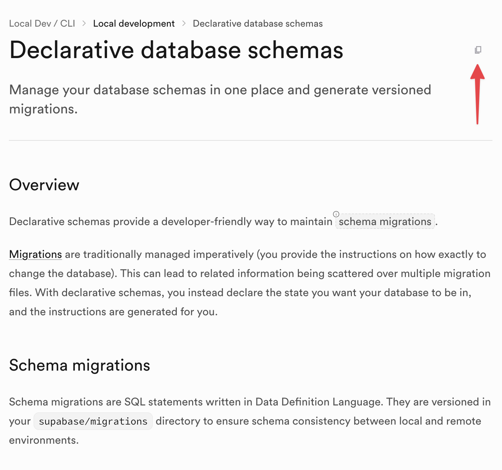

# CopyText

Chrome extension that adds copy buttons to specified elements on websites.

## Installation

1. Go to `chrome://extensions/`
2. Enable "Developer mode"
3. Click "Load unpacked"
4. Select this directory

## Configuration

Edit `config.js` to add sites and CSS selectors:

```javascript
const SITE_CONFIG = [
  {
    hostname: 'supabase.com',
    selectors: ['#sb-docs-guide-main-article', 'section.grid.gap-x-16.gap-y-8'],
  },
]
```

## Features

- Copies content as Markdown
- Shows on hover (shadcn-style)
- Works with dynamic content
- Dark mode support


